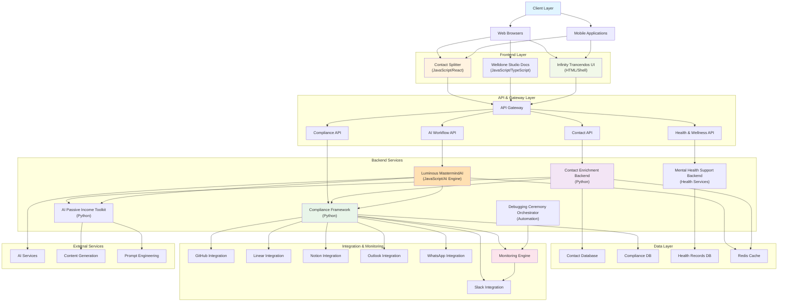

# Trancendos Estate - Architecture Overview

## System Architecture Diagram

## Component Overview

### Frontend Applications
- **Contact Splitter** - Contact management UI (JavaScript/React)
- **Welldone Studio Documentation** - Documentation portal (JavaScript/TypeScript)
- **Infinity Trancendos UI** - Mental health support interface (HTML/Shell)

### Backend Services
- **Contact Enrichment Backend** - Contact data processing and enrichment (Python)
- **Luminous MastermindAI** - AI-powered workflow automation platform (JavaScript/AI)
- **Compliance Framework** - Global compliance monitoring and validation (Python)
- **AI Passive Income Toolkit** - AI-driven income generation engine (Python)
- **Debugging Ceremony Orchestrator** - Automated code quality management
- **Mental Health Support Backend** - Health and wellness services

### Data Storage
- **Contact Database** - Stores enriched contact information
- **Compliance Database** - Compliance records and audit logs
- **Health Records Database** - Patient/user health data
- **Redis Cache** - High-performance caching layer

### Integrations
- **GitHub** - Repository integration and compliance monitoring
- **Linear** - Issue tracking integration
- **Notion** - Documentation and knowledge base integration
- **Slack** - Communication and notifications
- **Outlook** - Email and calendar integration
- **WhatsApp** - Mobile messaging integration

### External Services
- AI Services for intelligent automation
- Content Generation services
- Prompt Engineering utilities

## Technology Stack

| Component | Technology |
|-----------|-----------|
| Contact Management | Python (98%), JavaScript |
| AI Platform | JavaScript (100%) |
| Compliance | Python (100%) |
| Income Toolkit | Python (100%) |
| Documentation | JavaScript (66.8%), TypeScript (25.6%), CSS (6.6%) |
| Mental Health | HTML (64.1%), Shell (28.1%), JavaScript (7.8%) |

## Data Flow

1. **User Interactions** → Frontend Applications
2. **Frontend** → API Gateway → Backend Services
3. **Backend Services** → Data Layer (Databases/Cache)
4. **Compliance Framework** → Integrations (GitHub, Linear, Notion, Slack, Outlook, WhatsApp)
5. **Monitoring Engine** → Health Checks & Alerts
6. **AI Services** → External AI/ML Processing

## Key Features

- ✅ Unified contact management system
- ✅ Compliance and regulatory monitoring across multiple platforms
- ✅ AI-powered workflow automation
- ✅ Mental health and wellness support
- ✅ Passive income generation automation
- ✅ Automated code quality and debugging ceremonies
- ✅ Multi-platform integrations
- ✅ Comprehensive documentation

---

**Last Updated**: 2025-10-20
**Maintained by**: Trancendos